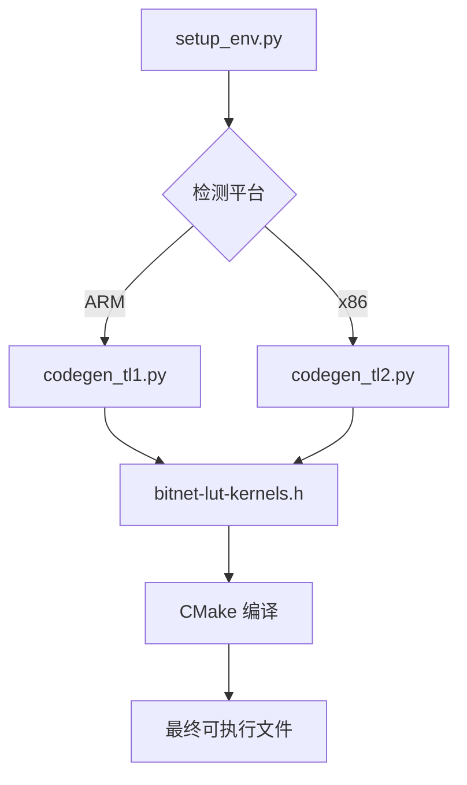

# 6. 代码生成系统

## 6.1 概述

BitNet.cpp 使用 Python 脚本动态生成优化的 C++ 内核代码，以适应不同的模型配置和硬件平台。

**生成器文件**:
- `utils/codegen_tl1.py` - ARM TL1 内核生成器
- `utils/codegen_tl2.py` - x86 TL2 内核生成器

## 6.2 TL1 代码生成器 (ARM)

### 6.2.1 命令行参数

```bash
python utils/codegen_tl1.py \
    --model bitnet_b1_58-large \
    --BM "256,128,256" \
    --BK "128,64,128" \
    --bm "32,64,32"
```

| 参数 | 描述 |
|------|------|
| `--model` | 目标模型名称 |
| `--BM` | M 方向的块大小列表 |
| `--BK` | K 方向的块大小列表 |
| `--bm` | M 方向的子块大小列表 |

### 6.2.2 生成的代码结构

生成的头文件 `include/bitnet-lut-kernels.h` 包含：

```cpp
// 1. 头文件和宏定义
#include "ggml-bitnet.h"
#define GGML_BITNET_MAX_NODES 8192

// 2. 全局变量
static bool initialized = false;
static bitnet_tensor_extra * bitnet_tensor_extras = nullptr;
static size_t bitnet_tensor_extras_index = 0;

// 3. 内存分配辅助函数
static void * aligned_malloc(size_t size) { ... }
static void aligned_free(void * ptr) { ... }

// 4. Per-tensor 量化函数
void per_tensor_quant(int k, void* lut_scales_, void* b_) { ... }

// 5. LUT 构建模板
template<int act_k>
inline void lut_ctor(int8_t* qlut, bitnet_float_type* b, 
                     bitnet_float_type* lut_scales) { ... }

// 6. 矩阵乘法内核
void kernel_xxx(...) { ... }

// 7. 类型检查函数
static bool is_type_supported(enum ggml_type type) { ... }
```

### 6.2.3 LUT 构建函数生成

```python
def gen_ctor_code():
    kernel_code = """
#include "ggml-bitnet.h"
#define GGML_BITNET_MAX_NODES 8192

// Per-tensor quantization using NEON
void per_tensor_quant(int k, void* lut_scales_, void* b_) {
    bitnet_float_type* lut_scales = (bitnet_float_type*)lut_scales_;
    bitnet_float_type* b = (bitnet_float_type*)b_;
#ifdef __ARM_NEON
    float32x4_t temp_max = vdupq_n_f32(0);
    for (int i=0; i < k / 4; i++) {
        float32x4_t vec_bs = vld1q_f32(b + 4 * i);
        float32x4_t abssum = vabsq_f32(vec_bs);
        temp_max = vmaxq_f32(abssum, temp_max);
    }
    float32_t scales = 127 / vmaxvq_f32(temp_max);
    *lut_scales = scales;
#endif
}

// LUT construction template
template<int act_k>
inline void lut_ctor(int8_t* qlut, bitnet_float_type* b, 
                     bitnet_float_type* lut_scales) {
#ifdef __ARM_NEON
    int16x8_t vec_lut[16];
    float32_t scales = *lut_scales;
    
    // Build lookup table for all 9 weight combinations
    for (int k = 0; k < act_k / 16; ++k) {
        // Load and quantize activations
        float32x4x2_t vec_bs_x0 = vld2q_f32(b + k * 16);
        float32x4_t vec_f_0 = vmulq_n_f32(vec_bs_x0.val[0], scales);
        int32x4_t vec_b_0 = vcvtnq_s32_f32(vec_f_0);
        
        // Build 9 combinations:
        // (-1,-1), (-1,0), (-1,+1), (0,-1), (0,0), (0,+1), (+1,-1), (+1,0), (+1,+1)
        vec_lut[0] = -vec_bs_0 - vec_bs_1;
        vec_lut[1] = -vec_bs_0;
        vec_lut[2] = -vec_bs_0 + vec_bs_1;
        // ...
        
        // Transpose for efficient table lookup
        Transpose_8_8(&vec_lut[0], ...);
    }
#endif
}
"""
    return kernel_code
```

### 6.2.4 内核代码生成

```python
def gen_body_core_code(bm, by):
    """生成内核核心计算代码"""
    length = 4
    all_code = ""
    for i in range(length):
        core_code = f"""
            // 加载权重
            uint8x16_t vec_a_{i} = vld1q_u8(a + i * KK / 2 + k * 32 * 2 + {i} * 16);
            
            // 分离高低 4 位
            uint8x16_t vec_a{i}_top = vshrq_n_u8(vec_a_{i}, 4);
            uint8x16_t vec_a{i}_bot = vandq_u8(vec_a_{i}, vec_mask);
            
            // 查表获取部分积
            int8x16_t vec_v_{i}_left = vqtbl1q_s8(vec_lut[...], vec_a{i}_top);
            int8x16_t vec_v_{i}_right = vqtbl1q_s8(vec_lut[...], vec_a{i}_bot);
            
            // 累加
            vec_sum_{i} = vaddq_s16(vec_sum_{i}, vec_v_{i}_left);
            vec_sum_{i} = vaddq_s16(vec_sum_{i}, vec_v_{i}_right);
        """
        all_code += core_code
    return all_code
```

### 6.2.5 矩阵尺寸配置

根据不同模型生成对应的内核：

```python
# bitnet_b1_58-large 配置
if get_model_name() == "bitnet_b1_58-large":
    run_command([
        sys.executable, "utils/codegen_tl1.py",
        "--model", "bitnet_b1_58-large",
        "--BM", "256,128,256",
        "--BK", "128,64,128",
        "--bm", "32,64,32"
    ])

# Llama3-8B 配置
elif get_model_name() in llama3_f3_models:
    run_command([
        sys.executable, "utils/codegen_tl1.py",
        "--model", "Llama3-8B-1.58-100B-tokens",
        "--BM", "256,128,256,128",
        "--BK", "128,64,128,64",
        "--bm", "32,64,32,64"
    ])

# bitnet_b1_58-3B 配置
elif get_model_name() == "bitnet_b1_58-3B":
    run_command([
        sys.executable, "utils/codegen_tl1.py",
        "--model", "bitnet_b1_58-3B",
        "--BM", "160,320,320",
        "--BK", "64,128,64",
        "--bm", "32,64,32"
    ])
```

## 6.3 TL2 代码生成器 (x86)

### 6.3.1 与 TL1 的主要区别

| 特性 | TL1 (ARM) | TL2 (x86) |
|------|-----------|-----------|
| SIMD 指令集 | NEON | AVX2/AVX512 |
| 向量宽度 | 128-bit | 256/512-bit |
| LUT 尺寸 | 较小 | 较大 |
| 查表指令 | `vqtbl1q_s8` | `_mm256_shuffle_epi8` |

### 6.3.2 x86 优化代码示例

```cpp
// Per-tensor quantization using AVX2
void per_tensor_quant(int k, void* lut_scales_, void* b_) {
    bitnet_float_type* lut_scales = (bitnet_float_type*)lut_scales_;
    bitnet_float_type* b = (bitnet_float_type*)b_;
    
#ifdef __AVX2__
    __m256 max_vec = _mm256_set1_ps(0.f);
    const __m256 vec_sign = _mm256_set1_ps(-0.0f);
    
    for (int i = 0; i < k / 8; i++) {
        __m256 vec_b = _mm256_loadu_ps(b + i * 8);
        __m256 vec_babs = _mm256_andnot_ps(vec_sign, vec_b);
        max_vec = _mm256_max_ps(vec_babs, max_vec);
    }
    
    // Horizontal max reduction
    __m128 max1 = _mm_max_ps(
        _mm256_extractf128_ps(max_vec, 1), 
        _mm256_castps256_ps128(max_vec));
    max1 = _mm_max_ps(max1, _mm_movehl_ps(max1, max1));
    max1 = _mm_max_ss(max1, _mm_movehdup_ps(max1));
    
    float scales = 127 / _mm_cvtss_f32(max1);
    *lut_scales = scales;
#endif
}
```

## 6.4 预调优内核

### 6.4.1 目录结构

```
preset_kernels/
├── bitnet_b1_58-3B/
│   ├── bitnet-lut-kernels-tl1.h    # ARM 预调优内核
│   ├── bitnet-lut-kernels-tl2.h    # x86 预调优内核
│   ├── kernel_config_tl1.ini       # TL1 配置
│   └── kernel_config_tl2.ini       # TL2 配置
├── bitnet_b1_58-large/
│   └── ...
└── Llama3-8B-1.58-100B-tokens/
    └── ...
```

### 6.4.2 使用预调优内核

```python
if args.use_pretuned:
    pretuned_kernels = os.path.join("preset_kernels", get_model_name())
    if not os.path.exists(pretuned_kernels):
        logging.error(f"Pretuned kernels not found for model {args.hf_repo}")
        sys.exit(1)
        
    if args.quant_type == "tl1":
        shutil.copyfile(
            os.path.join(pretuned_kernels, "bitnet-lut-kernels-tl1.h"), 
            "include/bitnet-lut-kernels.h")
        shutil.copyfile(
            os.path.join(pretuned_kernels, "kernel_config_tl1.ini"), 
            "include/kernel_config.ini")
```

## 6.5 内核配置文件

### 6.5.1 kernel_config.ini 格式

```ini
[kernel_0]
M = 256
K = 2560
BM = 256
BK = 128
bm = 32

[kernel_1]
M = 128
K = 6912
BM = 128
BK = 64
bm = 64

[kernel_2]
M = 256
K = 2560
BM = 256
BK = 128
bm = 32
```

### 6.5.2 参数含义

| 参数 | 描述 |
|------|------|
| M | 输出维度 |
| K | 输入维度 |
| BM | M 方向块大小 |
| BK | K 方向块大小 |
| bm | M 方向子块大小 |

## 6.6 调优指南

### 6.6.1 性能调优工具

```bash
python utils/kernel_tuning.py \
    --model bitnet_b1_58-large \
    --output tuned_config.ini
```

### 6.6.2 调优参数建议

| 硬件 | BM 范围 | BK 范围 | bm 范围 |
|------|---------|---------|---------|
| ARM Cortex-A78 | 128-256 | 64-128 | 32-64 |
| Apple M1/M2 | 128-320 | 64-128 | 32-64 |
| Intel x86 | 128-256 | 96 | 32 |
| AMD x86 | 128-256 | 96 | 32 |

### 6.6.3 调优原则

1. **L1 缓存适配**: BM × BK 应适应 L1 缓存大小
2. **向量化**: bm 应为 SIMD 向量宽度的倍数
3. **循环展开**: 较大的 BM、BK 允许更多展开
4. **负载均衡**: BM 应能整除 M 维度

## 6.7 生成流程



### 6.7.1 完整生成命令

```bash
# ARM 平台
python utils/codegen_tl1.py \
    --model BitNet-b1.58-2B-4T \
    --BM "160,320,320" \
    --BK "64,128,64" \
    --bm "32,64,32"

# x86 平台
python utils/codegen_tl2.py \
    --model BitNet-b1.58-2B-4T \
    --BM "160,320,320" \
    --BK "96,96,96" \
    --bm "32,32,32"
```
